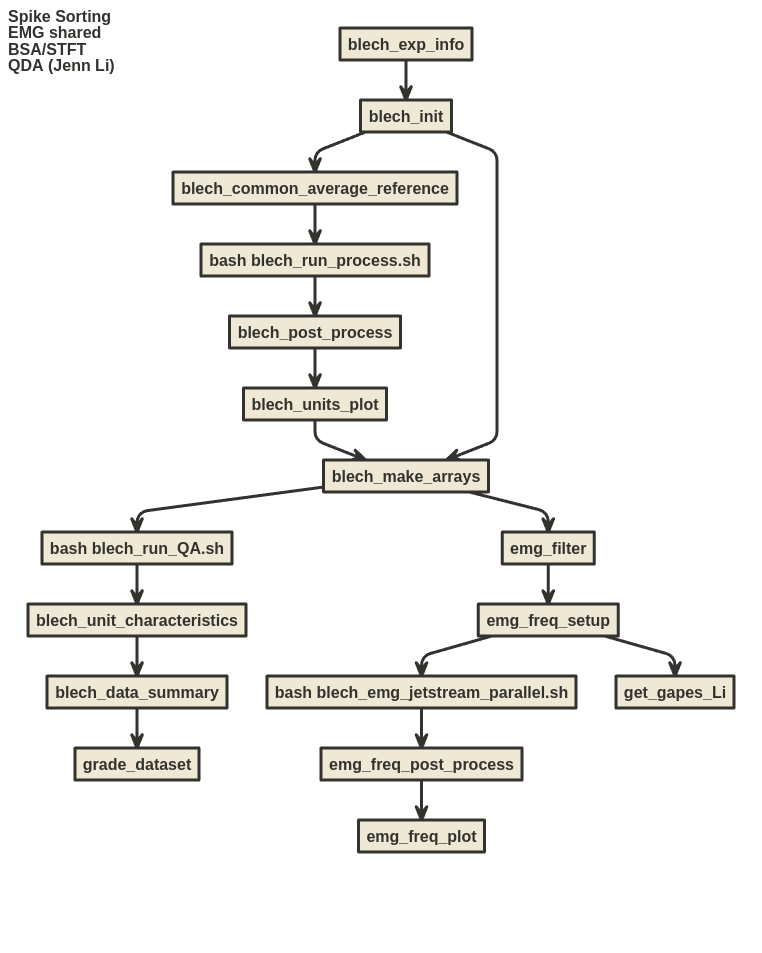

[](https://doi.org/10.5281/zenodo.15175272)
[](https://results.pre-commit.ci/latest/github/katzlabbrandeis/blech_clust/master)
[](https://katzlabbrandeis.github.io/blech_clust/)

# blech_clust

Python and R based code for clustering and sorting electrophysiology data recorded using the Intan RHD2132 chips. Originally written for cortical multi-electrode recordings in Don Katz's lab at Brandeis University.

**📚 [Full Documentation](https://katzlabbrandeis.github.io/blech_clust/)** | **🚀 [Getting Started](https://katzlabbrandeis.github.io/blech_clust/getting-started.html)** | **📖 [Tutorials](https://katzlabbrandeis.github.io/blech_clust/tutorials.html)** | **🔧 [API Reference](https://katzlabbrandeis.github.io/blech_clust/reference/)**

## Features

- **Automated Spike Sorting**: Complete pipeline from raw Intan data to sorted units
- **EMG Analysis**: BSA/STFT frequency analysis and QDA-based gape detection
- **Quality Assessment**: Built-in drift detection, unit similarity analysis, and dataset grading
- **Parallel Processing**: Optimized for HPC environments
- **Comprehensive Documentation**: Detailed guides, tutorials, and API reference

## Quick Start

```bash
# Clone the repository
git clone https://github.com/katzlabbrandeis/blech_clust.git
cd blech_clust

# Install everything
make all

# Activate the environment
conda activate blech_clust

# Run the pipeline
python blech_exp_info.py /path/to/data
bash blech_autosort.sh /path/to/data
```

For detailed instructions, see the [Getting Started Guide](https://katzlabbrandeis.github.io/blech_clust/getting-started.html).

## Documentation

For comprehensive documentation, visit **[katzlabbrandeis.github.io/blech_clust](https://katzlabbrandeis.github.io/blech_clust/)**

- **[Getting Started](https://katzlabbrandeis.github.io/blech_clust/getting-started.html)** - Installation and setup
- **[Tutorials](https://katzlabbrandeis.github.io/blech_clust/tutorials.html)** - Step-by-step workflows
- **[API Reference](https://katzlabbrandeis.github.io/blech_clust/reference/)** - Complete module documentation
- **[Blog](https://katzlabbrandeis.github.io/blech_clust/blogs/blogs_main.html)** - Updates and insights

### For building documentation locally:
```
pip install -r requirements/requirements-docs.txt
mkdocs serve
```

## Pipeline Overview

### Main Spike-Sorting Pipeline

The following diagram shows the complete operations workflow for the blech_clust pipeline:



#### Detailed Pipeline Steps

1. **blech_exp_info.py** - Pre-clustering step to annotate channels and save experimental parameters
2. **blech_init.py** - Initialize directories and prepare data for clustering
3. **blech_common_avg_reference.py** - Perform common average referencing
4. **blech_run_process.sh** - Parallel spike extraction and clustering
5. **blech_post_process.py** - Add selected units to HDF5 file
6. **blech_units_plot.py** - Plot waveforms of selected spikes
7. **blech_make_arrays.py** - Generate spike-train arrays
8. **blech_run_QA.sh** - Quality assurance checks
9. **blech_units_characteristics.py** - Analyze unit characteristics
10. **blech_data_summary.py** - Generate comprehensive dataset summary
11. **grade_dataset.py** - Grade dataset quality based on metrics

<details>
<summary>Nomnoml Schema</summary>

Copy and paste the following code into [nomnoml.com](https://www.nomnoml.com/) to generate the complete workflow diagram:

```nomnoml
Spike Sorting
[blech_exp_info] -> [blech_init]
[blech_init] -> [blech_common_average_reference]
[blech_common_average_reference] -> [bash blech_run_process.sh]
[bash blech_run_process.sh] -> [blech_post_process]
[blech_post_process] -> [blech_units_plot]
[blech_units_plot] -> [blech_make_arrays]
[blech_make_arrays] -> [bash blech_run_QA.sh]
[bash blech_run_QA.sh] -> [blech_unit_characteristics]
[blech_unit_characteristics] -> [blech_data_summary]
[blech_data_summary] -> [grade_dataset]

EMG shared
[blech_init] -> [blech_make_arrays]
[blech_make_arrays] -> [emg_filter]

BSA/STFT
[emg_filter] -> [emg_freq_setup]
[emg_freq_setup] -> [bash blech_emg_jetstream_parallel.sh]
[bash blech_emg_jetstream_parallel.sh] -> [emg_freq_post_process]
[emg_freq_post_process] -> [emg_freq_plot]

QDA (Jenn Li)
[emg_freq_setup] -> [get_gapes_Li]
```
</details>

### EMG Analysis

**Shared Steps:**

1. Complete spike sorting through `blech_make_arrays.py`
2. `emg_filter.py` - Filter EMG signals

**BSA/STFT Branch:**

- Bayesian Spectrum Analysis and Short-Time Fourier Transform for frequency analysis

**QDA Branch:**

- Quadratic Discriminant Analysis for gape detection (based on Li et al.'s methodology)

See the [Workflow Documentation](https://katzlabbrandeis.github.io/blech_clust/workflow.html) for additional workflow details and diagrams.

## Test Dataset

Test data available at: [Google Drive](https://drive.google.com/drive/folders/1ne5SNU3Vxf74tbbWvOYbYOE1mSBkJ3u3?usp=sharing)

## Contributing

We welcome contributions! Please read [CONTRIBUTING.md](CONTRIBUTING.md) for guidelines.

## Citation

If you use this code in your research, please cite:

```bibtex
@software{blech_clust_katz,
  author       = {Mahmood, Abuzar and Mukherjee, Narendra and
                  Stone, Bradly and Raymond, Martin and
                  Germaine, Hannah and Lin, Jian-You and
                  Mazzio, Christina and Katz, Donald},
  title        = {katzlabbrandeis/blech\_clust: v1.1.0},
  month        = apr,
  year         = 2025,
  publisher    = {Zenodo},
  version      = {1.1.0},
  doi          = {10.5281/zenodo.15175273},
  url          = {https://doi.org/10.5281/zenodo.15175273}
}
```

## Acknowledgments

This work used ACCESS-allocated resources at Brandeis University through allocation BIO230103 from the [Advanced Cyberinfrastructure Coordination Ecosystem: Services & Support](https://access-ci.org/) (ACCESS) program, supported by U.S. National Science Foundation grants #2138259, #2138286, #2138307, #2137603, and #2138296.

## License

See [LICENSE](LICENSE) for details.

---

**Visit the Katz Lab:** [katzlab.squarespace.com](https://katzlab.squarespace.com/)
